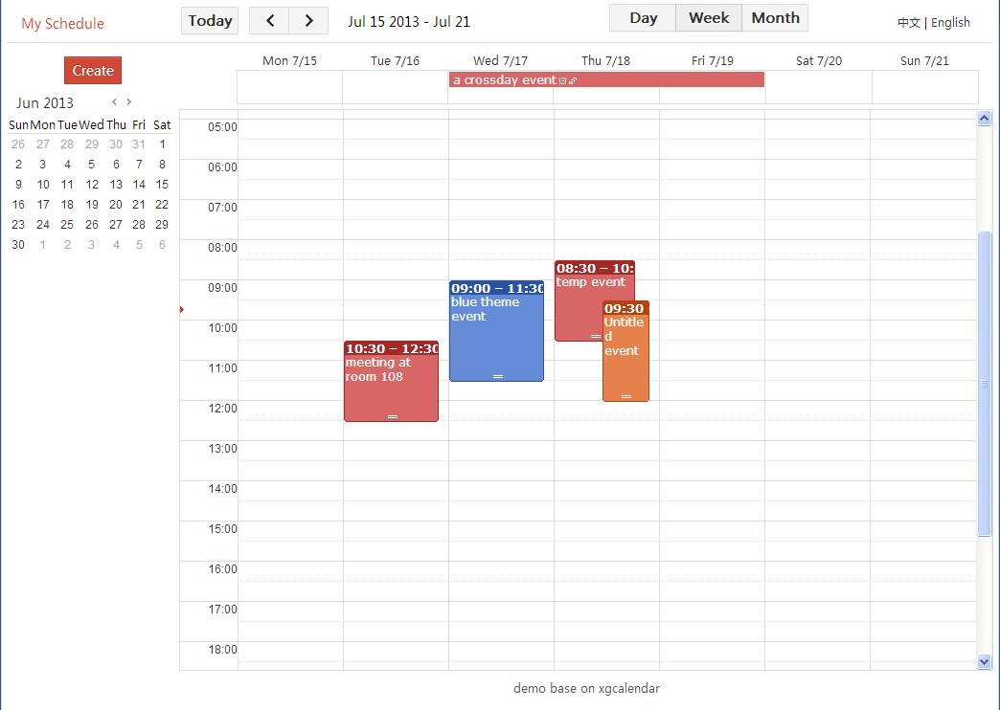
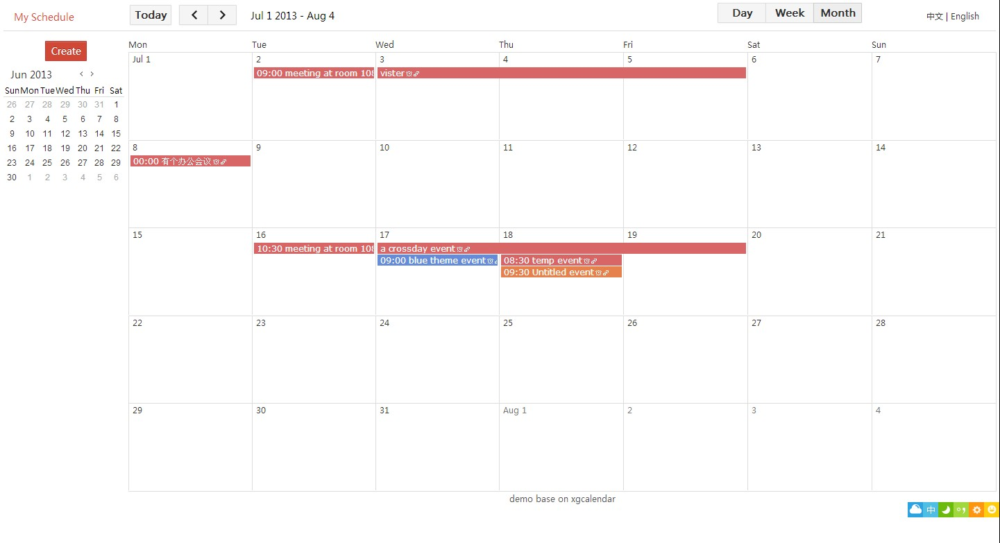

xgcalendar
========================================

Google like calendar js control
A jQuery plugin that enables us to create an event calendar that functions similar to the popular Google Calendar
Why named xgcalendar? X=xuanye G=Google Calendar Like

####week view

####month view

Lastest demo： [http://xgcal.sinaapp.com/demo2/](http://xgcal.sinaapp.com/demo2/ "click me")
Prev version： [http://xgcal.sinaapp.com/demo/](http://xgcal.sinaapp.com/demo/ "click me")

## Features

  * Day/week/month views
  * Support the definition of the start date of the week (Monday or Sunday)
  * Get and update data by ajax
  * Create/update/remove events by drag & drop
  * Quick delete
  * Quick update by drag/drop
  * Update event by Resize
  * Permission control
  * Themes
  * Good performance
  * I18n
  * Support IE6+, FireFox3.5+, Opera 10+, Chrome 3+

## Usage

html:

    
calendar element

include js:

    
    

javascript :

    var op = {
        view: "week", // default view type
        theme:1, // default theme style
        autoload:true,  // whether to automatically obtain the data for the current view of time after the page is loaded
        showday: new Date(), // time of current view
        EditCmdhandler:edit, // handler when event is clicked
        //DeleteCmdhandler:dcal,
        ViewCmdhandler:view,
        onWeekOrMonthToDay:wtd, // when weekview or month switch to dayview
        onBeforeRequestData: cal_beforerequest,
        onAfterRequestData: cal_afterrequest,
        onRequestDataError: cal_onerror,
        url: "/calendar/query" ,  // url for get event data by ajax request(post)
        quickAddUrl: "/calendar/add" ,   // url for quick add event data by ajax request(post)
        quickUpdateUrl: "/calendar/update" ,   // url for quick update event data by ajax request(post)
        quickDeleteUrl:  "/calendar/delete"  // url for quick delete event data by ajax request(post)
    };
    var _MH = document.documentElement.clientHeight; // Get the page height. This varies according to the document type. See examples.
    op.height = _MH-70; // container height;
    op.eventItems =[]; // default event data;
    $("#xgcalendarp").bcalendar(op);

## Options
- `view`:  Default view type, `day`,`week`,`month`.
- `weekstartday`: First day of week, 0 for sunday, `[0-6]`, default value is `1`.
- `theme`: Default color style, `[0-21]`, default value is `0`.
- `height`: Calendar view height，defaults to page height.
- `url`:  **required**  load data url.
- `eventItems`: Events data, it's an array. You can use it to init events data.
- `method`: Asynchronous request method. It is not recommended to change the default value `POST`.
- `showday`: Show date, default value `new Date()`.
- `onBeforeRequestData`: Event on before request data. You can use this parameter and the next ones for dynamic display effects.
- `onAfterRequestData`: Event on after the completion of the asynchronous call.
- `onRequestDataError`: Event on error occurs in the asynchronous call.
- `onWeekOrMonthToDay`: When week view or month switch to day view. The change is done internally, so this is is the public hook point.
- `quickAddHandler`: quickadd custom handler. If you set that parameter, quickAddUrl will be ignored.
- `quickAddUrl`: url for quick add event data by ajax request.
- `quickUpdateUrl`: url for quick update event data by ajax request.
- `quickDeleteUrl`: url for quick delete event data by ajax request.
- `autoload`: If set to `true`, auto load event data after initialization. If eventItems is not configured, you can set this parameter.
- `readonly`: If set to `true`, control will be read only.
- `extParam`: Additionnal parameter array of {name:" ", value:" "}. These will be add to asynchronous requests parameters.
- `enableDrag`: Default is true. Defined whether events are draggable. Disabled if view is `readonly`.
- `timeFormat`: Default value：`HH:mm`, t is a PM/AM switch, h 12 hours，H 24 hours, m for minutes.
- `tgtimeFormat`: "HH:mm" // Ibid.

## Data format

`eventItems` 's format
---
> eventItems is array type，the item of is also array type，item's format is as follows
> [primary key, title, startime, endtime，allday event flag，cross-day event flag, repeat event flag, theme, right permission flags, location, participants]
> data type as follows
> [String, String, Date, Date, 1/0, 1/0, 1/0, 0-21, 0/1, String, String]

## Available methods

All methods can be call using `$("#calendarid").functionName(params)`

- `BCalSwtichview(viewtype)` Swtich view. `viewtype` is one of `day`，`week`，`month`.
- `BCalReload` Reload event of current time range.
- `BCalGoToday(day)` Go to a range containing date. If view is week, it will go to a week containing the date. If view is month, it will got to a month containing the date.
- `BCalPrev` Go to previous date range. If view is week, it will go to previous week. If view is month, it will got to previous month.
- `BCalNext`  To go to next date range. If view is week, it will go to next week. If view is month, it will got to next month.
- `BcalGetOp` Get the current parameters. For usage tips when switching views, see demo.
- `BcalSetOp(p)` Set parameters. `p` is an array with additional parameter values, refer to `{p1: p1value}`. Parameters can be dynamically set.

## Available events
- `onBeforeRequestData(type)`: Number `type` represents the type of event (1:load, 2:add, 3:delete, 4:update).
- `onAfterRequestData(type)`: Same as above.
- `onRequestDataError(type,data)`: Type is as above. `data` is the error message sent by server, if any. `data`:object:`{ErrorCode:””,ErrorMsg:””}`.
- `onWeekOrMonthToDay(p)`: `p`:object, plugin option, to get p.dayshow, see in demo.

####Loading Params
 **request data sample**
>showdate=2013-1-9&viewtype=month&timezone=8

Showdate is the current date, viewtype is the current view, timezone is the time zone.
The server must compute the start date and end date, from the given showdate, viewtype and time zone offset. Then it must retrieve the events and encode them.

**response data sample**

>{"events":[],"issort":true,"start":"\/Date(1261353600000)\/","end":"\/Date(1261958399000)\/","error":null}

`events`: Data format is identical to `eventItems`.
`issort`: Whether are sorted (please do that on the server side).
`start` and `end`: Current view date range, json date format.
`error`: An exception object can be generated by the server. Format is `{ErrorCode:””,ErrorMsg:””}`. It is handled by `onRequestDataError`.

####Updating Params
**request data sample**
>calendarId=98&CalendarStartTime=2013-1-2+00%3A00&CalendarEndTime=2013-1-2+00%3A00&timezone=8
Date and time is formated according to your multi-language configuration choice.

**response data sample**
> {"IsSuccess":true,"Msg":""}

Error message when success and failure.

This is used on event deletetion and addition. If you want, you can look through the tools: Chrome use F12 to bring up the developer tools, switch the Network tab, you can see the operation.

##FAQ

* There is no java demo version
> No, I know. You are very welcome to contribute, if you want to provide one.

* How to control the time range 8:00 to 18:00 pm (similar to the control period)?
> xgcalendar does not provide such functionality. If you are willing to pay me, I'll consider helping you achieve that.

* Pop-up layer by clicking on the event can not get the focus, text can not be selected, and so on.
> This is probably because I disabled the bubble pop layers mousedown events, new input box can be obtained by clicking on the focus.
> In the code with the following piece of code pop-up layer:
> `buddle.mousedown (function (e) {return false})`
> `$(document).one("mousedown", function(){})`
> The main problem is this event. You can comment out the mousedown event above. Then click to determine whether the position inside the buddle. You can evaluation position, or eventtarget child element .

* I would like to add a new layer in the pop field. How to do it?
> First you have to add the corresponding input or select tags in html pop-layer;
> Second, in the code treating assignment to the value of this element, insert into the request parameters in the post, but also stored in the local cache.
> The last may have to modify some small flaws, depending on your test case. Although someone else once realize this, it was a long time ago, and I can not remember the whole process.

* What is xgcalendar copyright? Does it cost anything? Can it be used for commercial projects?
> Xgcalendar is an open source project. You can use it in a commercial project, free of charge; I only ask that you keep the copyright information. If you want me do do some custom development, then I may charge some fees, depending on the functional complexity of what you need.

* What about wdcalendar? This program is very similar to your xgcalendar?
> I found out it is indeed, or a Frenchman told me. wdcalendar is a complete copy of xgcalendar, but for the comments that were translated in English. I strongly despise such behavior, copying my plugins and pretend it's one's work. [http://www.web-delicious.com/jquery-plugins/](http://www.web-delicious.com/jquery-plugins/ "in this list"). That site is a pirate site, with no credit to my work. Common, guys...

* How to add Lunar calendar?
> Lunar calendar data can be generated on the server side, and then displayed on the client.

## License

(The MIT License)

Copyright (c) 2014 Xuanye and other contributors

Permission is hereby granted, free of charge, to any person obtaining
a copy of this software and associated documentation files (the
'Software'), to deal in the Software without restriction, including
without limitation the rights to use, copy, modify, merge, publish,
distribute, sublicense, and/or sell copies of the Software, and to
permit persons to whom the Software is furnished to do so, subject to
the following conditions:

The above copyright notice and this permission notice shall be
included in all copies or substantial portions of the Software.

THE SOFTWARE IS PROVIDED 'AS IS', WITHOUT WARRANTY OF ANY KIND,
EXPRESS OR IMPLIED, INCLUDING BUT NOT LIMITED TO THE WARRANTIES OF
MERCHANTABILITY, FITNESS FOR A PARTICULAR PURPOSE AND NONINFRINGEMENT.
IN NO EVENT SHALL THE AUTHORS OR COPYRIGHT HOLDERS BE LIABLE FOR ANY
CLAIM, DAMAGES OR OTHER LIABILITY, WHETHER IN AN ACTION OF CONTRACT,
TORT OR OTHERWISE, ARISING FROM, OUT OF OR IN CONNECTION WITH THE
SOFTWARE OR THE USE OR OTHER DEALINGS IN THE SOFTWARE.
